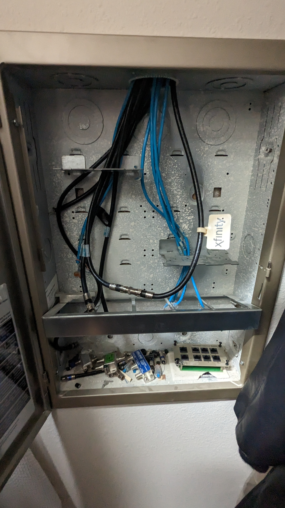
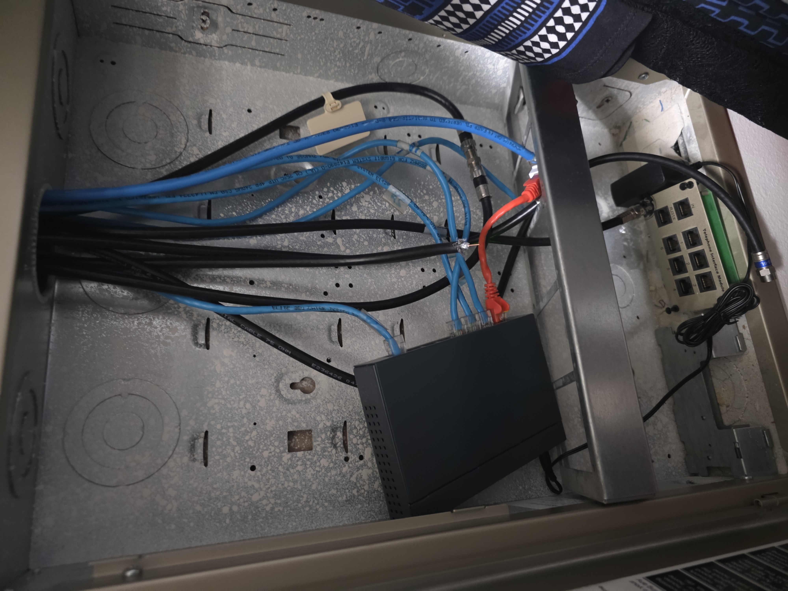

## Existing Infrastructure Assessment and Repurposing

During the initial assessment of the home, I identified an existing low-voltage wiring panel located in the master closet. The panel contained existing telephone and coaxial cabling, along with network-capable cabling serving multiple rooms throughout the home.

Although this location was already being used as the home's central low-voltage distribution point, it was not an ideal location for the primary network infrastructure. The enclosure provided limited physical space and airflow and was located in a closet where future expansion and equipment access would be difficult.

Rather than using the existing enclosure as the primary network location, I designed the network around a dedicated, more accessible equipment location that could accommodate future expansion.

The existing network-capable cable runs were retained and re-terminated where appropriate. A network switch was installed within the existing panel, allowing the existing room connections to be aggregated onto a single uplink back to the primary network location.

This approach allowed the existing infrastructure to remain useful while providing a more scalable central location for the primary network equipment.

### Existing Infrastructure

### Repurposed Infrastructure

